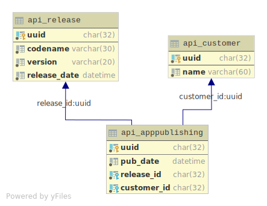
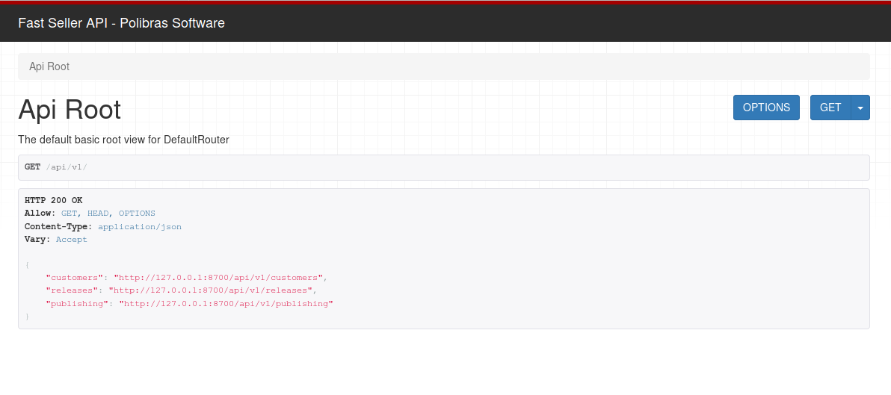

Visão geral
===========

Esta página descreve os recursos e endpoints da aplicação FastSeller XT REST API.  
Os recursos da API podem ser acessados livremente, não há qualquer autenticação.
Os recursos abordados a seguir são:  

- Customers
- Releases
- App Publishing

> **Nota 1:**  
> Talvez você queira voltar a seção sobre terminologia apresentada
> na página de [introdução](/drf-reman).  
> **Nota 2:**  
> para efeitos de illustração, vamos assumir durante o documento
> que  o endereço da API é: `http://127.0.0.1/api/v1`

**CRUD: Create, Retrieve, Update and Destroy**  
Para executar uma ação sobre um dado recurso, uma requisição HTTP é feita para um URL
que um identifica usando um verbo HTTP apropriado.

| Verbo         | Descrição                                                               |
| ------------- | ----------------------------------------------------------------------- |
| HEAD          | Pode ser emitido contra um recurso para obter informações de HTTP header|
| GET           | Usado para recuperar recursos                                           |
| POST          | Usado para criar recursos                                               |
| PUT           | Usado para atualizar um dado recurso                                    |
| DELETE        | Usado para atualizar um dado recurso                                    |


A representação interna das entidades é com segue:



**Acesso da API pelo navegador**  
Como esta aplicação está no topo do DRF, então podemos nos beneficiar da
[Browsable API](https://www.django-rest-framework.org/topics/browsable-api/),
digitando o endereço (ex: `http://127.0.0.1:8000/api/v1/`) no navegador:



Ou a versão em JSON: `http://127.0.0.1:8000/api/v1/?format=json`.  
A seção seguinte lista e documenta as operações sobre os endpoints.  

---

Customers endpoint
------------------

**GET - Listagem** 

```bash
curl -H 'Accept: application/json; indent=4' -X 'GET' 'http://127.0.0.1:8000/api/v1/customers'
```

Exemplo de retorno

```json
[
    {
        "uuid": "6193e9b3-7918-4ccc-8c38-be35602df2a1",
        "name": "FooBar LTDA"
    },
    {
        "uuid": "4e888c18-5819-4da1-b4b9-0d495f7a4a2a",
        "name": "ALIANCA DISTRIBUIDORES LTD"
    }
]
```

**POST - Criando um cliente**  
Parâmetros:

|nome | tipo   | descrição         |
|-----|--------|-------------------|
|name | string | O nome do cliente |

```bash
curl -H 'Content-Type: application/json' -X 'POST' 'http://127.0.0.1:8000/api/v1/customers' \
-d '{"name": "EMPRESA XYZ"}'
```
Exemplo de retorno
```bash
{"uuid":"e44ded41-e6f9-4cdb-a136-0f2d8977f2bb","name":"EMPRESA XYZ"}
```

**PUT - Editando um cliente**  
Parâmetros:

|nome | tipo   | descrição         |
|-----|--------|-------------------|
|name | string | O nome do cliente |

```bash
curl -H 'Content-Type: application/json' \
     -X 'PUT' 'http://127.0.0.1:8000/api/v1/customers/e44ded41-e6f9-4cdb-a136-0f2d8977f2bb' \
     -d '{"name": "EMPRESA ltd"}'
```

Exemplo de retorno
```bash
{"uuid":"e44ded41-e6f9-4cdb-a136-0f2d8977f2bb","name":"EMPRESA ltd"}
```

---

Releases endpoint
-----------------

**GET - Listagem** 

```bash
curl -H 'Accept: application/json; indent=4' -X 'GET' 'http://127.0.0.1:8000/api/v1/releases'
```

Exemplo de retorno
```json
[
    {
        "uuid": "42cdb17a-5c19-46be-819c-d6a06672c04d",
        "version": "1.2.0",
        "codename": "",
        "release_date": "2019-03-27T05:03:16.467478Z"
    },
    {
        "uuid": "fb0276a6-11ab-4457-b9a6-ee6ba7e2b6e9",
        "version": "1.0.1",
        "codename": "Ambar",
        "release_date": "2019-03-27T03:36:39.288735Z"
    }
]
```

**POST - Criando um release/versão**  
Parâmetros:

|nome        | tipo   | obrigatório?| descrição                        |
|------------|--------|-------------|--------------------------------  |
|version     | string | sim         |O código da versão, como: 1.0.1   |
|codename    | string | não         |O code name da versão             |
|release_date| string | não         |A data de release. Formato ISO8601|
 
 > **Nota**  
 > *O [formato](https://en.wikipedia.org/wiki/ISO_8601) para `release_date` é algo como: 2019-03-29T09:40:56-03:00*


```bash
curl -H 'Content-Type: application/json' -X 'POST' 'http://127.0.0.1:8000/api/v1/releases' \
     -d '{"version": "3.1.16", "codename": "steel", "release_date": "2019-03-29T09:40:56-03:00"}'
```
Exemplo de retorno
```json
{
  "uuid": "66c58e53-93f3-4df8-be02-c8670250f851",
  "version": "3.1.16",
  "codename": "steel",
  "release_date": "2019-03-29T12:40:56Z"
}
```

**PUT - Editando um release**  
Parâmetros:

|nome        | tipo   | obrigatório?| descrição                        |
|------------|--------|-------------|--------------------------------  |
|version     | string | sim         |O código da versão, como: 1.0.1   |
|codename    | string | não         |O code name da versão             |
 
```bash
curl -H 'Content-Type: application/json' \
     -X 'PUT' 'http://127.0.0.1:8000/api/v1/releases/66c58e53-93f3-4df8-be02-c8670250f851' \
     -d '{"version": "3.1.22", "codename": "Bee"}'
     
```
Exemplo de retorno
```json
{
  "uuid": "66c58e53-93f3-4df8-be02-c8670250f851",
  "version": "3.1.22",
  "codename": "Bee",
  "release_date": "2019-03-29T12:40:56Z"
}
```

---

App Publishing endpoint
-----------------------

Como vimos na parte inicial da documentação, na seção terminologia,
uma publicação representa um específico release do disponibilizado para um cliente.  
Tem informações como a versão recebida pelo cliente, o próprio cliente e quando
este recebeu o update/release.

**GET - Listagem** 

Parâmetros/filtros:  

|nome        | tipo   | obrigatório?| descrição                                     |
|------------|--------|-------------|-----------------------------------------------|
|customer    | string | não         |nome ou parte do nome de um cliente            |
|pub_date    | string | não         |data (ISO8601) de quando recebeu a atualização |
|version     | string | não         |versão para filtrar                            |
 

```bash
curl -H 'Accept: application/json; indent=4' -X 'GET' 'http://127.0.0.1:8000/api/v1/publishing'
```
ou
```bash
curl -H 'Accept: application/json; indent=4' -X 'GET' \
  'http://127.0.0.1:8000/api/v1/publishing?customer=LTDA&pub_date=2019-03-27T06:40&version=1.2.0'
```

Exemplo de retorno

```json
[
    {
        "uuid": "2c2f98df-0ede-4315-9c04-bb36a98baf9e",
        "customer": "6193e9b3-7918-4ccc-8c38-be35602df2a1",
        "release": "fb0276a6-11ab-4457-b9a6-ee6ba7e2b6e9",
        "pub_date": "2019-03-27T06:12:41.293705Z"
    },
    {
        "uuid": "a99f9767-c7ea-4054-9116-d89522402ebd",
        "customer": "6193e9b3-7918-4ccc-8c38-be35602df2a1",
        "release": "42cdb17a-5c19-46be-819c-d6a06672c04d",
        "pub_date": "2019-03-27T06:43:22.117721Z"
    }
]
```

**POST - Criando/Disponibilizando uma release para um cliente**  

Parâmetros:  

|nome        | tipo   | obrigatório?| descrição                                     |
|------------|--------|-------------|-----------------------------------------------|
|customer    | string | sim         |o identificador (uuid) de um cliente           |
|version     | string | sim         |o identificador (uuid) de um release           |
 
 
```bash
customer_id=5bb566f1-d259-4023-a064-6968a3c052f8
release_id=66c58e53-93f3-4df8-be02-c8670250f851

curl -H 'Content-Type: application/json' -X 'POST' 'http://127.0.0.1:8000/api/v1/publishing' \
     -d '{"customer": "$customer_id", "release": "$release_id"}'

```

Exemplo de retorno

```json
{
  "uuid": "b567193a-a267-4bd0-8652-3c8e7b4ca4c5",
  "customer": "5bb566f1-d259-4023-a064-6968a3c052f8",
  "release": "66c58e53-93f3-4df8-be02-c8670250f851",
  "pub_date": "2019-03-29T16:19:16.891829Z"
}
```

Possíveis erros ao tentar atribuir um release para um cliente são descritos a seguir.  

1) *Versão sendo aplicada é mais antiga que a que o cliente possui:*

```bash
curl -iH 'Content-Type: application/json' -X 'POST' 'http://127.0.0.1:8000/api/v1/publishing' 
    -d $payload

HTTP/1.0 400 Bad Request
Server: WSGIServer/0.1 Python/2.7.13
...

{"non_field_errors":["A versão sendo aplicada é mais antiga que a que o cliente possui."]}
```

2) *Cliente já tem a versão que está sendo aplicada. Nesse caso você receberá o seguinte retorno:*

```bash
curl -iH 'Content-Type: application/json' -X 'POST' 'http://127.0.0.1:8000/api/v1/publishing' 
    -d $payload

HTTP/1.0 400 Bad Request
Server: WSGIServer/0.1 Python/2.7.13
...

{"non_field_errors":["Cliente já possui esta versão."]}
```

**PUT - Editando um registro de atribuição de release**  

Parâmetros:  

|nome        | tipo   | obrigatório?| descrição                                     |
|------------|--------|-------------|-----------------------------------------------|
|customer    | string | sim         |o identificador (uuid) de um cliente           |
|version     | string | sim         |o identificador (uuid) de um release           |
 

```bash
customer_id=5bb566f1-d259-4023-a064-6968a3c052f8
release_id=66c58e53-93f3-4df8-be02-c8670250f851
id=b567193a-a267-4bd0-8652-3c8e7b4ca4c5

curl -H 'Content-Type: application/json' -X 'PUT' 'http://127.0.0.1:8000/api/v1/publishing/$id' \
     -d '{"customer": "$customer_id", "release": "$release_id"}'

```

Exemplo de retorno

```json
{
  "uuid": "b567193a-a267-4bd0-8652-3c8e7b4ca4c5",
  "customer": "5bb566f1-d259-4023-a064-6968a3c052f8",
  "release": "66c58e53-93f3-4df8-be02-c8670250f851",
  "pub_date": "2019-03-29T16:19:16.891829Z"
}
```

Os demais possíveis retornos são os mesmos de quando estamos criando
um registro via POST.


**DELETE - Excluindo recursos**

Para todos os recursos descritos acima, a exclusão segue o mesmo padrão de request:

```bash
curl -X 'DELETE' 'http://127.0.0.1:8000/api/v1/{resource}/{id}'
```
